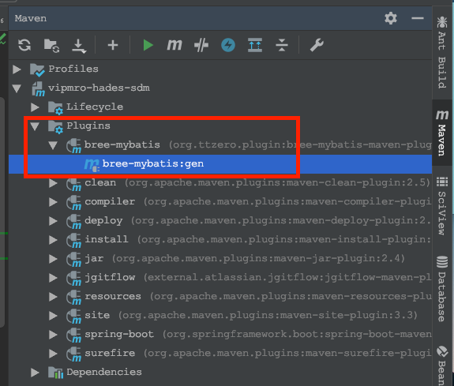

[ ![Build Status] [travis-image] ] [travis] [ ![Release] [release-image] ] [releases] [ ![License] [license-image] ] [license]

bree-mybatis-maven-plugin源于github开源项目`mybatis-dalgen`，本项目修改了大量已知BUG并且在设计思路也与原项目异同，
bree更接近mybatis原始mapper，除了个别增强属性外几乎与原始mapper相同，这样可以减少学习成本，同时对老项目有较好的兼容。
后来作者将项目迁到国内oschina地址是[mybatis.generator](https://gitee.com/bangis/mybatis.generator)在此感谢原作者bangis.wangdf

bree与原项目相比有着更加丰富的配置项，可以对Mapper, dao, service, vo, dto等java文件的`annotation`，`extends`以及`implements`进行配置，
以满足不同项目的需求。

除此之外还可以在reserved文件添加数据库"保留词"，这些保留词或关键词将被特殊包裹（自动生成的部分）。

默认的bree通过DML生成初始的全字段的BaseResultMap和Base_Column_List，以及与表对应
的do对象。同时还会生成默认insert/update/deleteById/getById操作，如果项目集成第
三方工具已包含此功能可以通过`<create-default-operation value="false"/>`关闭默认
CRUD操作。

`add-to-git-if-new`配置项可以在生成新文件时执行`git add`方法。

## 使用方法

#### 1. 在项目pom.xml文件添加

```
  <build>
    <plugins>
      <plugin>
        <groupId>org.ttzero.plugin</groupId>
        <artifactId>bree-mybatis-maven-plugin</artifactId>
        <version>0.1.13</version> <!-- 替换为最新版 -->
        <dependencies>
          <dependency>
            <groupId>mysql</groupId>
            <artifactId>mysql-connector-java</artifactId>
            <version>8.0.15</version>
          </dependency>
        </dependencies>
        <configuration>
          <copyTemplate>true</copyTemplate><!-- 初次执行时设为true以复制模版 -->
        </configuration>
      </plugin>
    </plugins>
  </build>
```

*插件不主动引入jdbc，请根据具体的数据库进行配置*

配置好上面的plugin后运行命令`mvn bree-mybatis:gen`或者在IDE上可视化运行

- [jetbrains]


- [eclipse]


eclipse添加maven build: 鼠标右击项目 -> Run As... -> Run Configurations, 弹出窗口选择Maven build新添加一个build项
name随意,goals填写`bree-mybatis:gen` -> Apply。保存好后下次就可以直接右击项目 -> Run As... Maven build运行插件了。

成功运行后会提示如下信息

```
[INFO] Scanning for projects...
[INFO]                                                                         
[INFO] ------------------------------------------------------------------------
[INFO] Building bree-mybatis-example 1.0.0-SNAPSHOT
[INFO] ------------------------------------------------------------------------
[INFO] 
[INFO] --- bree-mybatis-maven-plugin:0.1.13:gen (default-cli) @ bree-mybatis-example ---
[INFO] 初始化配置信息开始
初始化完成,下一步到/Users/guanquan.wang/workspace/bree-mybatis-example/bree/config/config.xml配置数据源
```

默认情况下会在项目的根目录生成一个bree文件夹，结构如下

```
|-bree
 |-config
 |-templates
  |-fmpp
  |-init
  |-lib
 |-reserved
```

下一步需要在`config.xml`文件中配置数据源和其它代码生成相关配置项，然后再次执行`mvn bree-mybatis:gen`命令，命令窗口会提示你输入要生成
的表名，输入表名回车即完成Mapper接口,vo,dto以及mapper.xml的自动生成。

所有的修改请在bree/xxxTables下对应的表名xml中修改，大部分的写法与直接写mybatis mapper没有区别，修改后再次执行命令即可

## 配置说明

### database 数据源配置

数据源配置是必须的，如果未配置或配置错误将无法使用此插件。
示例:

```
  <database name="sdm" class="org.gjt.mm.mysql.Driver" type="mysql">
    <property name="url" value="jdbc:mysql://localhost:3306/test"/>
    <property name="user" value="root"/>
    <property name="password" value="root"/>
    <prefix value="sdm"/>
    <split-suffix value="_000"/>
  </database>
```

说明:
- name: 必要参数，配置为schema即可，可以任意。插件会将相同name的xml放在同一个目录下
- class: jdbc类，可不修改
- type: 目前仅支持mysql
- property: 常见的jdbc配置
- prefix: 表前缀(可多个)，添加了此前缀，最终生成的文件将会去掉所配置的前缀，否则将全名。比如:
    有表名sdm_user，如果配置了`<prefix value="sdm"/>`，最终生成文件是"User"而不是"SdmUser"
- split-suffix: 分表前缀(可多个)

### package 代码文件目录

此配置为生成java文件的output路径，`XMLMapper`并不放在此目录，可选变数`${project.name}`和`${database.name}`

示例: `<package value="org.ttzero.${project.name}.${database.name}"/>`

### xml-mapper

修改生成的mybatis xml文件存放位置，默认的xml-mapper放在`resources/${package}/mapper`目录下。
也可以将其放到任意目录下。

### create-default-operation 是否自动创建基础CRUD功能

bree-mybatis会生成基础的insert/update/deleteById/getById功能，其中insert和update为全字段插入或更新。
如果这些功能已经由第三方包提供则可以将此参数设为`false`, 此参数默认true。

### java 文件相关配置

bree-mybatis将生成Do,Vo,Dao,Service,Controller等java相关文件，每一种类型都可以独立配置，
并且它们有相同的配置项。

> 目录对泛型支持不友好
>
> bree-mybatis并不反射父类的方法。所以会出现覆盖父类法方的情况。

以下是一个典型的配置示例:

```
  <controller ignore="true">
    <!-- 包名 默认controller-->
    <namespace />
    <!-- 前缀 默认无-->
    <prefix />
    <!-- 后缀 默认Controller-->
    <suffix />
    <!-- 配置Controller类的继承 默认无-->
    <extends>
      <extend class="" import=""/>
    </extends>
    <!-- 配置Controller类的实现 默认无-->
    <implements>
      <implement class="" import=""/>
    </implements>
    <!-- 配置Controller类的注解 默认无-->
    <annotations>
      <annotation class="" import=""/>
    </annotations>
  </controller>
```

说明:
- controller: 为目标文件类型。每种类型以下都会有详细配置说明
- ignore: 是否忽略此配置，如果为`true`时将不生成相关java文件，也可简写为`<controller ignore="true" />`
- namespace: 命名空间也是包名。controller文件将放在`${package}/${namespace}`目录下
- prefix: 文件前缀。默认无
- suffix: 文件后缀。controller文件配置后缀为`Controller`
- extends: 配置继承(可多个)。
- implements: 配置接口实现(可多个)
- annotations: 配置注解(可多个)

后三个可配置多个子项，其中`class`要简写，`import`要写该class需要引入的路径。
如下是一个典型的Rest controller配置:

```
<annotations>
  <annotation class="RestController"
              import="org.springframework.web.bind.annotation.RestController" />
  <annotation class='RequestMapping("/${DO.className}")'
              import="org.springframework.web.bind.annotation.RequestMapping" />
</annotations>
```

通过以上配置sdm_user表将会生成如下`UserController`文件

```
import org.springframework.web.bind.annotation.RequestMapping;
import org.springframework.web.bind.annotation.RestController;

@RestController
@RequestMapping("/User")
public class UserController {

}
```

以下配置将只描述特殊配置

#### data-object DO配置

DO是数据库对应的实体，bree-mybatis将通过meta data生成全字段DO类。通常表定义都有一些共用的字段
如: id, create_by, create_at, update_by, update_at, delete_flag等字段，这些字段没必要在每
个DO类中生成。相反通常的做法是写一个BaseDo，然后在DO配置在添加`<extends>`项，然后将这些共有的字段
在其它DO中忽略。

示例:

```
<extend class="BaseModel&lt;${DO.className}&gt;" />
<ignore>
  <field name="id"/>
  <field name="createAt"/>
  <field name="createBy"/>
  <field name="updateAt"/>
  <field name="updateBy"/>
  <field name="deleteFlag"/>
</ignore>
```

说明: 由于BaseModel是一个泛型，原型为`BaseModel<T>`，所以这里class配置为`BaseModel&lt;${DO.className}&gt;`
注意XML转义，这样生成的UserDo里将继承BaseModel并且忽略id等字段。

#### do-mapper

do-mapper与xml-mapper一一对应，终最生成一个接口。常见的配置是添加`Mapper`注解

#### vo

VO是SQL参数对象，分页SQL默认继承bree-mybatis自带的`BasePageVo`，如果项目已有自己的分页参数
可以设置`<useBasePageVo value="false" />`来忽略自带`BasePageVo`，再配置`<extends>`
添加自己的分页参数

### add-to-git-if-new

生成的新文件自动运行`git add`命令，默认true

**此功能要求命令行支持git命令，可自行设置class path以支持git命令**


## 关于junit

- [BreeMojoTest](src/test/java/org/ttzero/plugin/bree/mybatis/BreeMojoTest.java) 测试mysql数据库需要自行配置[config](src/test/resources/bree/config/mysql/config.xml)文件
然后修改`ConfigUtil.setCmd("sdm_rewrite")`为测试表名即可
- [BreeMojoSqliteTest](src/test/java/org/ttzero/plugin/bree/mybatis/BreeMojoSqliteTest.java) 测试sqlite数据库，可以直接运行。初始表为STUDENT配置文件[config](src/test/resources/bree/config/sqlite/config.xml)
，同时测试SQL文件对应[mapper](src/test/resources/bree/config/testTables/STUDENT.xml)，需要将SQL写在此文件

*测试输出文件放在target/out目录下*

## 示例

1. 分页查询

```
<select id="paging" vo="Rewrite" multiplicity="paging" remark="Paging query">
    select
    <include refid="Base_Column_List"/>
    from sdm_rewrite
    <include refid="whereCondition"/>
    order by update_at desc
</select>
```

生成的XMLMapper.xml文件结果

```
<!-- Paging query PageCount -->
<select id="pagingCount" resultType="int">
    SELECT
    COUNT(*) AS total 
    FROM
     sdm_rewrite
    <include refid="whereCondition"/>
    
</select>

<!-- Paging query PageResult -->
<select id="pagingResult" resultMap="BaseResultMap">
select
    <include refid="Base_Column_List"/>
    from sdm_rewrite
    <include refid="whereCondition"/>
    order by update_at desc
    limit #{pageSize} offset #{offset}
</select>
```

Mapper.java文件

```
/**
 * Paging query.
 * @param rewrite rewrite
 * @return int
 */
int pagingCount(RewriteVo rewrite);

/**
 * Paging query.
 * @param rewrite rewrite
 * @return List<Rewrite>
 */
List<Rewrite> pagingResult(RewriteVo rewrite);
```

2. 同一个xml文件分页语句paging属性相同时，将会进行合并处理。
